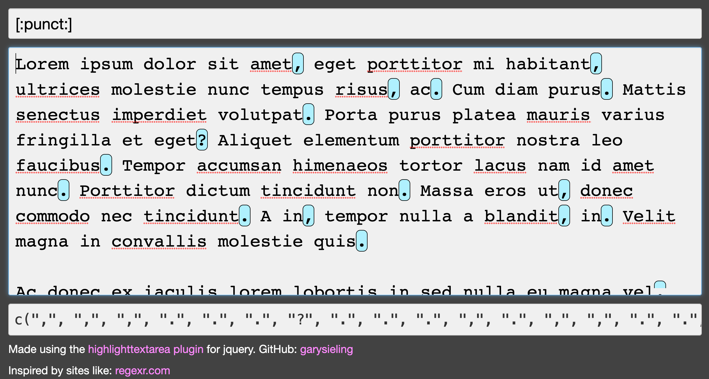
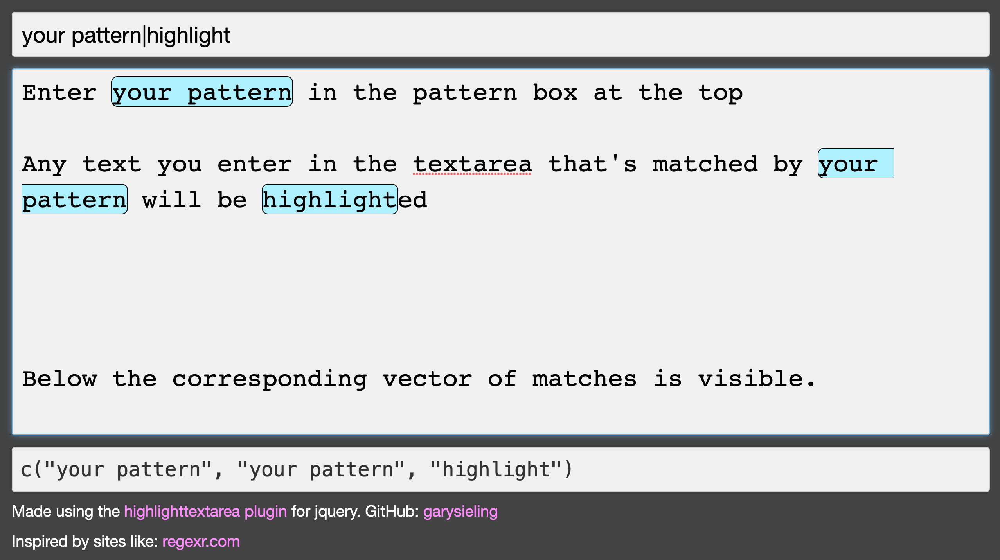

# retestr

Basic shiny app to test regular expressions

## Available on Heroku

The live version of the app is hosted and available on Heroku at
[https://retestr.herokuapp.com/](https://retestr.herokuapp.com/)

Or you can run the app locally by:

1. cloning this repo
2. opening the .Rproj file
3. opening the global.R file
4. hitting the run app button.

## Motivation

I liked sites like: [regexr.com](https://regexr.com) a lot. But one thing that was lacking was the ability to use pre-built character classes, which are compatible with the `{stringr}` package in R.

So this testing sandbox allows for similar functionality but uses R and stringr to locate the matches and then passes the location of the matches to a jquery plugin that does the highlighting.

## Usage

You can enter the pattern you'd like to test in the top box.

You can enter any string you'd like to test that pattern against.

The highlighting will update when either change.

For info on pattern matching with `{stringr}`: [online documentation](https://stringr.tidyverse.org/articles/regular-expressions.html)

## Acknowledgements

Would be impossible without:

|Tool|source|
|--|---|
| R | [Get the latest version](https://cran.r-project.org/) |
| RStudio|[Download link](https://www.rstudio.com/products/rstudio/download/)|
|shiny|[https://shiny.rstudio.com/](https://shiny.rstudio.com/)|
|stringr|[stringr site](https://stringr.tidyverse.org/index.html)|
|jquery|[https://jquery.com/](https://jquery.com/)|
|jquery.highlightTextarea|[index.html](http://garysieling.github.io/jquery-highlighttextarea/index.html)|
